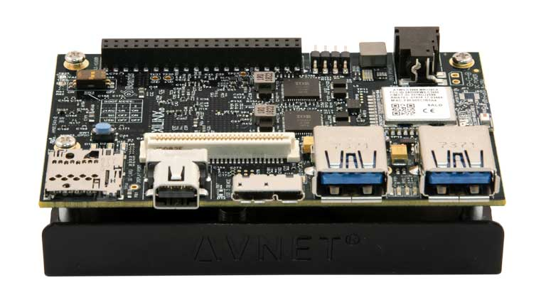

# ROS 2 Hardware Acceleration Working Group

This document defines the scope and governance of the Working Group (WG). The rationale behind some decisions is further justified in `REP-2008`: *ROS 2 Hardware Acceleration Architecture and Conventions* (see [pending PR](https://github.com/ros-infrastructure/rep/pull/324)).

| Item | Description |
|------|-------------|
| **Mission** | Drive creation, maintenance and testing of acceleration kernels on top of open standards (C++ and OpenCL) for optimized ROS 2 and Gazebo interactions over different compute substrates (including FPGAs, GPUs and ASICs). |
| **Scope** | hardware acceleration in a) embedded (edge) devices, b) workstations, c) data centers and d) cloud |
| **Objectives** | `2021` :white_check_mark: 1) Design tools and conventions to seamlessly integrate acceleration kernels and related embedded binaries into the ROS 2 computational graphs leveraging its existing build system ([ament_acceleration](https://github.com/ros-acceleration/ament_acceleration) extensions) [^1], meta build tools ([colcon-acceleration](https://github.com/ros-acceleration/colcon-acceleration) extension) and a new firmware layer ([acceleration_firmware](https://github.com/ros-acceleration/acceleration_firmware)) [^3]. |
|  |  `2021` :white_check_mark: 2) Provide [reference examples](https://github.com/ros-acceleration/acceleration_examples) and blueprints for acceleration architectures used in ROS 2 and Gazebo. |
|  |  `2022` :white_check_mark: 3) Facilitate testing environments that allow to benchmark accelerators with special focus on power consumption and time spent on computations (see [HAWG benchmarking approach](https://github.com/ros-infrastructure/rep/pull/324/files#diff-f230b6aa06d86bf594d8e431300e453ad7343e8f4b1932252b6d36c62a8b5e0aR203-R267), [community#9](https://github.com/ros-acceleration/community/issues/9), [tracetools_acceleration](https://github.com/ros-acceleration/tracetools_acceleration), [ros2_kria](https://github.com/ros-acceleration/ros2_kria)) |
|  | `2022` :warning: 4) Survey the community interests on acceleration for ROS 2 and Gazebo (see [discourse announcement](https://discourse.ros.org/t/hardware-acceleration-in-ros-2-and-gazebo-survey/23228), [survey](https://forms.gle/JibETmf92XyUde4r5)). |
|  | `2022` :warning: 5) Produce demonstrators with robot components, real robots and fleets that include acceleration to meet their targets (see [acceleration_examples](https://github.com/ros-acceleration/acceleration_examples)). |
|  |  `2022` :white_check_mark: 7) Acceleration of complete ROS 2 computational graphs https://github.com/ros-acceleration/community/issues/20 |
|  |  `2022` :new: 8) Merge first hardware accelerators (kernels) into upstream packages (*candidate*: [image_pipeline](https://github.com/ros-acceleration/image_pipeline), see `image_pipeline` instrumented at [#717](https://github.com/ros-perception/image_pipeline/pull/717) ) |
|  |  `2022` :new: 9) Documentation and a *"methodology to hardware accelerate a ROS 2 package"* (see :white_check_mark: [#20](https://github.com/ros-acceleration/community/issues/20)) |
|  |  `2022` :new: 10) Organize *workshops on robotics and ROS 2 Hardware Acceleration* |
|  |  `2022` :new: 11) Robotic Processing Unit, first demonstrators [#25](https://github.com/ros-acceleration/community/issues/25) |

[^1]: See [ament_vitis](https://github.com/ros-acceleration/ament_vitis)
[^3]: See [acceleration_firmware_kv260](https://github.com/ros-acceleration/acceleration_firmware_kv260) for an exemplary *vendor extension* of the `acceleration_firmware` package

- [ROS 2 Hardware Acceleration Working Group](#ros-2-hardware-acceleration-working-group)
  - [The ROS 2 Hardware Acceleration Stack](#the-ros-2-hardware-acceleration-stack)
  - [Reference hardware platforms](#reference-hardware-platforms)
    - [Official](#official)
    - [Unofficial](#unofficial)
    - [Adding your board](#adding-your-board)
  - [Subprojects](#subprojects)
    - [Subproject List](#subproject-list)
    - [Standards for subprojects](#standards-for-subprojects)
    - [Adding new subprojects](#adding-new-subprojects)
    - [Subproject changes](#subproject-changes)
    - [Deprecating subprojects](#deprecating-subprojects)
  - [Governance](#governance)
    - [Meetings](#meetings)
    - [Communication Channels](#communication-channels)
    - [Backlog Management](#backlog-management)
    - [Membership, Roles and Organization Management](#membership-roles-and-organization-management)
    - [Modifying this governance document](#modifying-this-governance-document)
  - [References](#references)

## The ROS 2 Hardware Acceleration Stack

The ROS 2 Hardware Acceleration Stack is a series of *extensions to ROS 2 which allow to leverage hardware acceleration and create custom compute architectures providing <ins>a faster ROS 2 execution and a timing-safe event-driven programming interface</ins>*. The stack is composed of 4 key elements and aims to be hardware and vendor-agnostic:

| # | Standard/convention | Title | Rationale |
|---|---------------------|-------|-----------|
| `1` | [REP 2009](https://ros.org/reps/rep-2009.html) | [`Type Negotiation Feature`](https://ros.org/reps/rep-2009.html) | Allow ROS 2 Nodes to dynamically negotiate the message types used by publishers and subscriptions, as well adaptively modifying the behavior of publisher and subscriptions to align with accelerators |
| `2` | [REP 2008](https://github.com/ros-infrastructure/rep/pull/324) | [`ROS 2 Hardware Acceleration Architecture and Conventions`](https://github.com/ros-infrastructure/rep/pull/324) | Architectural pillars and conventions required to introduce hardware acceleration in ROS 2 in a scalable and technology-agnostic manner. Presents one interface for all hardware acceleration vendors. |
| `3` | [REP 2007](https://ros.org/reps/rep-2007.html) | [`Type Adaptation Feature`](https://ros.org/reps/rep-2007.html) | An extension to rclcpp that will make it easier to convert between ROS types and custom, user-defined types for Topics, Services, and Actions. |
| `4` | [REP 2000](https://ros.org/reps/rep-2000.html) | [`ROS 2 Releases and Target Platforms`](https://ros.org/reps/rep-2000.html) | Production-grade multi-platform ROS support with Yocto |

The ROS 2 Hardware Acceleration Working Group contributes and maintains open source implementations of various components of the stack above. A complete implementation of the `ROS 2 Hardware Acceleration Stack` including professional support, documentation, examples as well as reference designs is available at Acceleration Robotics' [ROBOTCORE™](https://accelerationrobotics.com/robotcore.php). Other solutions that implement of *part of the stack* include AMD's [KRS](https://xilinx.github.io/KRS/) (the Kria Robotics Stack), or NVIDIA's NITROS (NVIDIA Isaac Transport for ROS).

## Reference hardware platforms

### Official
The following boards are recommended and actively used for development:

| Board | Picture | Description | Firmware |
|------------|-------|-------------|-------|
| [Kria KR260 Robotics Starter Kit](https://www.xilinx.com/products/som/kria/kr260-robotics-starter-kit.html) |  | The Kria™ KR260 robotics starter kit is built for robotics and industrial applications, complete with high performance interfaces and native ROS 2 support for ease of development by roboticists and software developers.  | [`acceleration_firmware_kr260`](https://github.com/ros-acceleration/acceleration_firmware_kr260)|
| [Kria `KV260` Vision AI Starter Kit](https://www.xilinx.com/products/som/kria/kv260-vision-starter-kit.html) |  | The Kria™ KV260 starter kit is a development platform for the K26, the first adaptive Single Board Computer. KV260 offers a compact board for edge vision and robotics applications.  | [`acceleration_firmware_kv260`](https://github.com/ros-acceleration/acceleration_firmware_kv260)|

### Unofficial

The following list includes boards that have been validated and have unofficial community support. *No guarantees provided since no CI jobs are run on on these boards*.

Community supported boards

| Board | Picture | Description | Firmware |
|------------|-------|-------------|-------|
| [Xilinx Zynq UltraScale+ MPSoC `ZCU102` Evaluation Kit](https://www.xilinx.com/products/boards-and-kits/ek-u1-zcu102-g.html) |  | The ZCU102 Evaluation Kit enables designers to jumpstart designs for automotive, industrial, video, and communications applications. This kit features a Zynq® UltraScale+™ MPSoC with a quad-core Arm® Cortex®-A53, dual-core Cortex-R5F real-time processors, and a Mali™-400 MP2 graphics processing unit  | [`acceleration_firmware_zcu102`](https://github.com/ros-acceleration/acceleration_firmware_zcu102)|
| [AVNET Ultra96-V2](https://www.avnet.com/wps/portal/us/products/new-product-introductions/npi/aes-ultra96-v2/) |  |  The Ultra96-V2 is an Arm-based, Xilinx Zynq UltraScale+™ MPSoC development board based on the Linaro 96Boards Consumer Edition (CE) specification and designed with a certified radio module from Microchip providing Wi-Fi and Bluetooth. All components are updated to allow industrial temperature grade options. Additional power control and monitoring will be possible with the included Infineon PMICs.| [`acceleration_firmware_ultra96v2`](https://github.com/ros-acceleration/acceleration_firmware_ultra96v2)|
| [Zynq UltraScale+ MPSoC `ZCU104` Evaluation Kit](https://www.xilinx.com/products/boards-and-kits/zcu104.html) |  |  The ZCU104 Evaluation Kit enables designers to jumpstart designs for embedded vision applications such as surveillance, Advanced Driver Assisted Systems (ADAS), machine vision, Augmented Reality (AR), drones and medical imaging. This kit features a Zynq® UltraScale+™ MPSoC EV device with video codec and supports many common peripherals and interfaces for embedded vision use case. | |
| [NVIDIA Jetson Nano](https://news.accelerationrobotics.com/ros-2-humble-in-nvidia-jetson-nano-with-yocto/) | 	 | 	The Jetson Nano™ Developer Kit is a small, powerful computer that lets you run multiple neural networks in parallel for applications like image classification, object detection, segmentation, and speech processing. All in an easy-to-use platform that runs in as little as 5 watts.| [acceleration_firmware_jetson_nano](https://github.com/ros-acceleration/acceleration_firmware_jetson_nano)|

### Adding your board

The recipe for adding a new board to the community is as follows ([reach out](mailto:v.mayoralv@gmail.com) :email:  if you need help):

1. Check out the [Initial draft of REP-2008 - ROS 2 Hardware Acceleration Architecture and Conventions](https://github.com/ros-infrastructure/rep/pull/324)
2. Create your own firmware repository (e.g. `acceleration_firmware_Ultra96V2`) for the corresponding board (see [acceleration_firmware_kv260](https://github.com/ros-acceleration/acceleration_firmware_kv260) for an example)
3. Once the firmware repo is finalized, assess the capabilities of the hardware according to REP-2008 and create a table in the README.md that argues about it (see [example here](https://github.com/ros-acceleration/acceleration_firmware_kv260#hardware-acceleration-capabilities))
4. Submit a PR to [ros-acceleration/community](https://github.com/ros-acceleration/community) to add your board to the community, with the corresponding support level according to REP-2008

## Subprojects

This Working Group owns and maintains the following Subprojects.
Its meetings and membership are largely focused on the direction, design, and work on the projects.

### Subproject List

The following subprojects are owned by the Working Group:

**Core Architecture**
- [`ament_acceleration`](https://github.com/ros-acceleration/ament_acceleration): CMake macros and utilities to include hardware acceleration in the ROS 2 build system (ament) and its development flows.
- [`ament_vitis`](https://github.com/ros-acceleration/ament_vitis): CMake macros and utilities to include Vitis platform into the ROS 2 build system (`ament`) and its development flows.
- [`colcon-hardware-acceleration`](https://github.com/ros-acceleration/colcon-hardware-acceleration): An extension for colcon-core to include Hardware Acceleration capabilities.
- [`ros2acceleration`](https://github.com/ros-acceleration/ros2acceleration): acceleration command for ROS 2 command line tools.
- [`tracetools_acceleration`](https://github.com/ros-acceleration/tracetools_acceleration): LTTng tracing provider wrapper for ROS 2 packages in the Hardware Acceleration Working Group.
- [`acceleration_firmware`](https://github.com/ros-acceleration/acceleration_firmware): Base ROS 2 package for hardware acceleration firmware. Used to organize firmware dependencies across vendors.

**Examples and utilities for hardware acceleration**
- [`acceleration_examples`](https://github.com/ros-acceleration/acceleration_examples): ROS 2 package examples demonstrating the use of hardware acceleration.
- [`adaptive_component`](https://github.com/ros-acceleration/adaptive_component): A composable container for Adaptive ROS 2 Node computations. Select between FPGA, CPU or GPU at run-time.
- [`image_pipeline`](https://github.com/ros-acceleration/image_pipeline): A fork for the ros-perception `image_pipeline` package that includes hardware acceleration capabilities for demonstrations purposes.

**Robotic Processing Unit (RPU)**
- [meta-ticket](https://github.com/ros-acceleration/community/issues/25)
### Standards for subprojects

Subprojects must meet the following criteria (and the WG agrees to maintain them upon adoption).

* Build passes against ROS 2 Foxy - :warning: *moving to Rolling*
* If packages are part of nightly builds on the ROS build farm, there are no reported warnings or test failures
* Issues and pull requests receive prompt responses
* Releases go out regularly when bugfixes or new features are introduced
* The backlog is maintained, avoiding longstanding stale issues

### Adding new subprojects

To request introduction of a new subproject, add a list item to the "Subprojects" section and open a Pull Request to this repository, following the default Pull Request Template to populate the text of the PR.

PR will be merged on unanimous approval from Approvers.

### Subproject changes

Modify the relevant list item in the "Subprojects" section and open a Pull Request to this repository, following the default Pull Request Template to populate the text of the PR.

PR will be merged on unanimous approval from Approvers.

### Deprecating subprojects

Projects cease to be useful, or the WG can decide it is no longer in their interest to maintain. We do not commit to maintaining every subproject in perpetuity.

To suggest removal of a subproject, remove the relevant list item in the "Subprojects" section and open a Pull Request in this repository, following instructions in the Pull Request Template to populate the text of the PR.

PR will be merged on unanimous approval from Approvers. If the repositories of the subproject are under the WG's GitHub organization, they will be transferred out of the organization or deleted at this time.

## Governance

### Meetings

Except for vacation periods and other exceptions, regular WG Meeting will generally happen once a month or more often. Meetings are announced in ROS Discourse and [minutes](https://docs.google.com/document/d/185Cy1xjpAOgJygEOnlf5OCgOQTywmF0qgSpS3GiW16Q/edit#) are kept.

- [Proposal for ROS 2 Hardware Acceleration Working Group (HAWG)](https://discourse.ros.org/t/proposal-for-ros-2-hardware-acceleration-working-group-hawg/20112/27)
- [ROS 2 Hardware Acceleration Working Group, meeting #1](https://discourse.ros.org/t/announcing-the-hardware-acceleration-wg-meeting-1/20826) ([recording](https://www.youtube.com/watch?v=QfRHJgeSAOw))
- [ROS 2 Hardware Acceleration Working Group, meeting #2](https://discourse.ros.org/t/hardware-acceleration-wg-meeting-2/21789) ([recording](https://www.youtube.com/watch?v=a1I4rue1px8))
- [ROS 2 Hardware Acceleration Working Group, meeting #3](https://discourse.ros.org/t/hardware-acceleration-wg-meeting-3/22535) ([recording](https://www.youtube.com/watch?v=GUwS3La8s6Y))
- [ROS 2 Hardware Acceleration Working Group, meeting #4](https://discourse.ros.org/t/hardware-acceleration-wg-meeting-4/22972) ([recording](https://youtu.be/zHawzTtxuhA))
- [ROS 2 Hardware Acceleration Working Group, meeting #5](https://discourse.ros.org/t/hardware-acceleration-wg-meeting-5/23827) ([recording](https://www.youtube.com/watch?v=ac-Yr2sRIxk&list=PLf4Fnww4KiFeiP1fNQXgJhyuEI760NVIl&index=5))
- [ROS 2 Hardware Acceleration Working Group, meeting #6](https://discourse.ros.org/t/hardware-acceleration-wg-meeting-6/24207/6) ([recording](https://www.youtube.com/watch?v=MXrl4dkBA-4&list=PLf4Fnww4KiFeiP1fNQXgJhyuEI760NVIl))
- [ROS 2 Hardware Acceleration Working Group, meeting #7](https://discourse.ros.org/t/hardware-acceleration-wg-meeting-7/24603) ([recording](https://www.youtube.com/watch?v=AOFHsCeiBEA&list=PLf4Fnww4KiFeiP1fNQXgJhyuEI760NVIl&index=2))
- [ROS 2 Hardware Acceleration Working Group, meeting #8](https://discourse.ros.org/t/hardware-acceleration-wg-meeting-8/25147) ([recording](https://www.youtube.com/watch?v=KgxHmkFNNpA&list=PLf4Fnww4KiFeiP1fNQXgJhyuEI760NVIl&index=2))
- [ROS 2 Hardware Acceleration Working Group, meeting #9](https://discourse.ros.org/t/hardware-acceleration-wg-meeting-9/25499) ([recording](https://www.youtube.com/watch?v=HROPmnIOjS4&list=PLf4Fnww4KiFeiP1fNQXgJhyuEI760NVIl&index=2))
- [ROS 2 Hardware Acceleration Working Group, meeting #10](https://discourse.ros.org/t/hardware-acceleration-wg-meeting-10/25852) 

### Communication Channels

* Instant messaging: [Matrix community](https://matrix.to/#/!wXVMnnDXlUNzkRjNCh:matrix.org?via=matrix.org) (*Matrix is an open network for secure, decentralized communication*).
* Meeting invite group: [Meeting invite group](https://groups.google.com/g/ros-2-hardware-acceleration-wg)
* Github organization: [ros-acceleration](https://github.com/ros-acceleration)
* Discourse tag: [wg-acceleration](https://discourse.ros.org/tag/wg-acceleration)

<!-- {{How can members communicate with each other? Discourse, Discord, IRC, email list, etc.}} -->

### Backlog Management

Backlog management is performed using [Github Projects](https://github.com/ros-acceleration/community/projects). So far:

- ~~[Phase 1: tools, examples, benchmarking and first demonstrators](https://github.com/ros-acceleration/community/projects/1)~~ (:warning: *deprecated*)
- [ROS 2 Hardware Acceleration WG backlog](https://github.com/orgs/ros-acceleration/projects/1)

### Membership, Roles and Organization Management

Working Group members may act in one or more of the following roles:

* **Member**
  * Prerequisite: Attend at least one out of the last three Working Group meetings
  * Responsible for triaging issues
* **Reviewer**
  * All reviewers are members
  * Prerequisite: Proven track record of high-quality reviews to WG subprojects
  * Responsible for reviewing pull requests
* **Approver**
  * All approvers are reviewers
  * Prerequisite: Proven track record of high-quality contributions and reviews to WG subprojects
  * Responsible for approving and merging pull requests
  * Responsible for vetting and accepting new projects into the Working Group
* **Lead**
  * Responsible for organizing and moderating working group meetings
  * Responsible for posting meeting materials (minutes, recordings, etc.)
  * Responsible for breaking ties

To become a member or change role, create an issue in this repository using the appropriate issue template.
Such applications are accepted upon unanimous agreement from Approvers, and are typically based on the applicant's history with the subprojects of the Working Group.

### Modifying this governance document

Changes to this document will be made via Pull Request. The PR will be merged on unanimous agreement from Approvers.

## References

- [1] [Mayoral-Vilches, V., & Corradi, G. (2021). Adaptive Computing in Robotics, Leveraging ROS 2 to Enable Software-Defined Hardware for FPGAs. arXiv preprint arXiv:2109.03276.](https://arxiv.org/ftp/arxiv/papers/2109/2109.03276.pdf)

- [2] Mayoral-Vilches, V., REP-2008 - ROS 2 Hardware Acceleration Architecture and Conventions (see [pending PR](https://github.com/ros-infrastructure/rep/pull/324))

- [3] [Mayoral-Vilches, V. (2021). Kria Robotics Stack A ROS 2-centric Approach for Hardware Acceleration in Robotics](https://www.xilinx.com/content/dam/xilinx/support/documentation/white_papers/wp540-kria-robotics-stack.pdf). Xilinx Inc.

- [4] [Lienen, C., Platzner, M., & Rinner, B. (2020, December). ReconROS: Flexible Hardware Acceleration for ROS2 Applications. In 2020 International Conference on Field-Programmable Technology (ICFPT) (pp. 268-276). IEEE.](https://bernhardrinner.com/pubs/2020/Lienen_FPT2020.pdf)

- [5] [Lienen, C., & Platzner, M. (2021). Design of Distributed Reconfigurable Robotics Systems with ReconROS. arXiv preprint arXiv:2107.07208.](https://arxiv.org/pdf/2107.07208)

- [6] [Wan, Z., Yu, B., Li, T. Y., Tang, J., Zhu, Y., Wang, Y., ... & Liu, S. (2021). A survey of fpga-based robotic computing. IEEE Circuits and Systems Magazine, 21(2), 48-74.](https://arxiv.org/abs/2009.06034)

- [7] [Mayoral-Vilches, V., Neuman, S. M., Plancher, B., & Reddi, V. J. (2022). RobotCore: An Open Architecture for Hardware Acceleration in ROS 2. arXiv preprint arXiv:2205.03929.](https://arxiv.org/pdf/2205.03929.pdf)

- [8] [Ichnowski, J., Chen, K., Dharmarajan, K., Adebola, S., Danielczuk, M., Mayoral-Vilches, V., ... & Goldberg, K. (2022). FogROS 2: An Adaptive and Extensible Platform for Cloud and Fog Robotics Using ROS 2. arXiv preprint arXiv:2205.09778.](https://arxiv.org/pdf/2205.09778.pdf)
